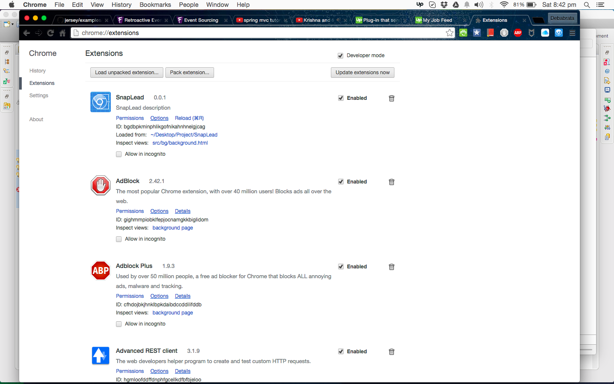

# SnapLead

+ download [SnapLead](https://github.com/dtripathy10/SnapLead.git)

+ Type `chrome://extensions/` on chrome url

+ Click `Load Unpacked Extension` and point to the unziped project folder(SnapLead)

+ 
